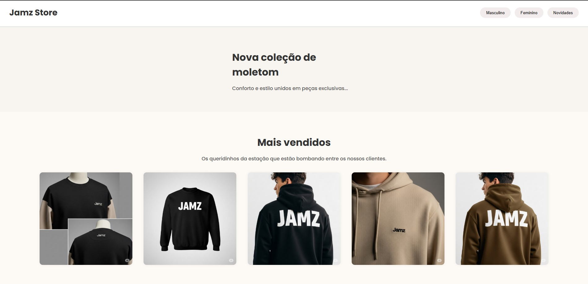

<<<<<<< HEAD
Fashion Store

Site simples de loja de roupas feito com HTML e CSS.

🔧 Tecnologias

- HTML5  
- CSS3  
- Layout responsivo (Flexbox)


=======
# Store
```
# 🛍️ Projeto Front-End - Site de E-commerce

Este é um projeto simples de front-end para um site de e-commerce, desenvolvido utilizando HTML e CSS puro. O objetivo é simular a página principal de uma loja online com um layout responsivo e agradável ao usuário.

## 📁 Estrutura de Pastas

📁 Store
- ├── 📁 .git
- ├── 📁 css
- │ └── 📄 style.css
- ├── 📁 img
- │ ├── 📷 imagens do projeto
- ├── 📄 README.md
- ├── 📄 index.html


## 📸 Prévia do Site

Abaixo você pode conferir uma prévia do layout desenvolvido:

### 🖼️ Tela Inicial  


## 🧰 Tecnologias Utilizadas

- HTML5  
- CSS3  
- [Google Fonts](https://fonts.google.com/)  
- Imagens livres de direitos autorais  

---

## ✅ Funcionalidades

- Layout responsivo  
- Seção de banner  
- Catálogo com produtos  
- Rodapé com informações de contato
>>>>>>> 091d0dd (update)
